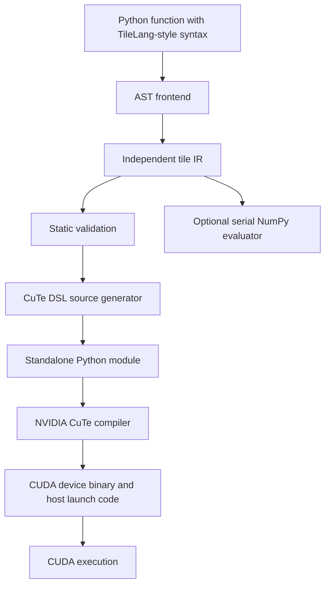

# Compiler architecture

All Ntilang compiler modules are written in Python. The core has no third-party
runtime dependencies.

## Frontend and IR

`language.py` provides the annotation types, syntax markers, and `prim_func`
decorator. Kernel bodies are captured as Python functions and parsed through
`inspect` and `ast`. Shape specialization happens in ordinary Python factory
functions before parsing.

`frontend.py` recognizes an explicit grammar. It constructs immutable buffer,
expression, region, statement, and kernel records from `ir.py`. It evaluates
whitelisted static expressions and preserves statement locations for diagnostics.
It does not execute the decorated kernel body. Executing its surrounding Python
module or factory follows ordinary Python semantics.

## Validation

`validation.py` bounds intermediate integer index arithmetic and checks a
sufficient condition for affine write injectivity. For coefficients sorted by
absolute value, each larger coefficient must exceed the total possible span of
the smaller coefficients. This makes each participating induction variable
recoverable from a coordinate. Every active block/tile variable must be covered.

The frontend also tracks initialization and collective placement. Buffer types,
copy extents, GEMM shapes, operand dtypes, warp arrangements, and shared-memory
requirements are checked before code generation. Rejected programs include
valid programs beyond the current analysis rules.

These checks constrain the accepted source programs. Formal proofs of the
Python implementation and the full NVIDIA compilation chain are not implemented.

## Lowering

`codegen.py` emits a complete CuTe Python module. A linear tile is distributed
using `flat = thread + slot * threads`, then unflattened in row-major order.
Global loads use guarded scalar reads with zero initialization. Stores use bounds
predicates. Shared copies and shared-tile reuse use uniform block barriers.

GEMM uses `cute.make_tiled_mma(MmaF16BF16Op(...))`. CuTe partitions shared operands
into MMA register fragments. The source language's `(K, N)` B operand is viewed
as CuTe's `(N, K)` operand through its layout strides. `cute.gemm` emits the
warp-level MMA operation. Accumulator stores use the matching CuTe identity-tensor
partition to recover logical output coordinates.

Copies and MMA register loads are currently synchronous. Performance scheduling
and asynchronous copy pipelines require additional implementations and tests.

## Compilation and runtime

`compiler.py` exposes source generation, saving, lazy NVIDIA compilation, and
tensor argument checks. Generated source is named by its SHA256 in
`~/.cache/ntilang`, or `NTILANG_CACHE_DIR` when set. The returned object retains
the NVIDIA executable after its first successful build. NVIDIA manages its own
lower-level compiler caches.

`compile_kernel()` creates fake compact tensor signatures and invokes CuTe with
an explicit architecture and the TVM FFI ABI. TVM FFI is a separate ABI package;
the Ntilang frontend and lowering pipeline do not use the TVM compiler or TileLang.

## Validation layers

The test suite separates Python/frontend checks, serial IR reference evaluation,
actual CuTe compilation, and optional GPU execution. Compiler tests inspect the
embedded device binary's ELF machine identifier. GPU tests cover numerical
results and a nondefault stream. Hardware tests remain necessary to validate
execution on a particular device and toolchain combination.
